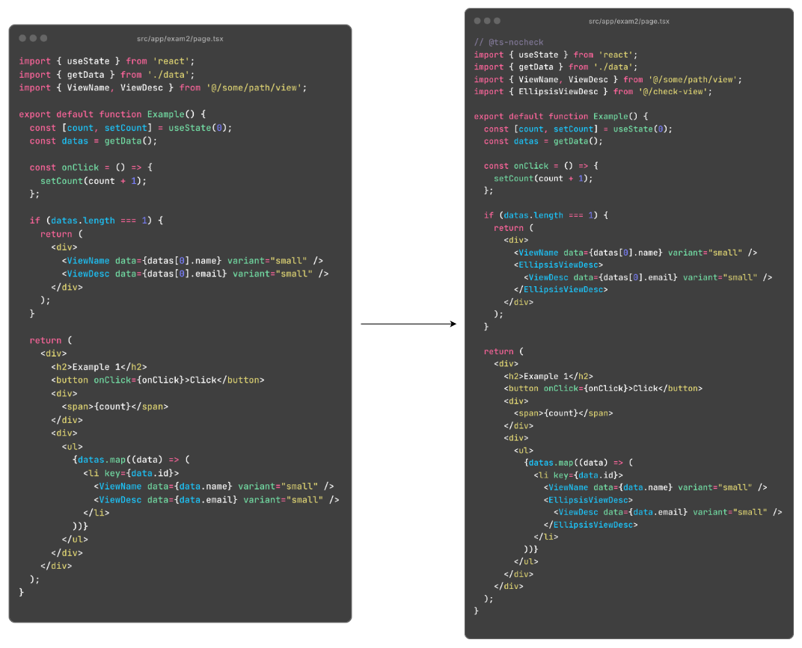

`jsx-inject` is a CLI tool that helps you easily transform repetitive code by automatically wrapping specific JSX elements or adding desired import statements across multiple React component files in your project.

It is useful for large-scale refactoring, applying design systems, or adding common wrappers.

<figure>
  
  <figcaption>
    <code>pnpx jsx-inject --import-path '@/check-view' -t "src/app/**/*.tsx" "src/components/**/*.tsx" -c ViewDesc</code>
  </figcaption>
</figure>

## Getting Started

### Create a Wrapping Component

You need to create a file for the wrapping component.  
The component must be `export`ed and must return a `JSX.Element`.  
It should be written to accept `children` and wrap them.

> If multiple components are exported, the first one will be used for wrapping.  
> `export default` is also supported.

```bash
cd my-project
```

```tsx
// component/example-wrapper.tsx
export function Wrap({ children }: { children: React.ReactNode }) {
  if (process.env.NODE_ENV === 'development') {
    return null;
  }

  return <div className="wrapper">{children}</div>;
}
```

### Running the Program

There are two ways to run the program:

- `CLI Mode`: Start the wrapping process for the specified component via command line options.
- `File Mode`: Start the process based on a `jsx-inject.config.json` file in your project root.

#### CLI Mode

```bash
cd my-project
pnpx jsx-inject --import-path '~/common/comp' -t "src/components/*.tsx" "src/app/**/*.tsx"
```

Option descriptions:

- `--import-path`: Specifies the path to the wrapping component to be added.
- `-t, --target`: Specifies the file paths of the target components to wrap. You can specify multiple paths separated by commas.
- `-c, --target-component (optional)`: Specifies the name of the target component to wrap. (If omitted, the entire component will be wrapped.)
- `--props (optional)`: Specifies props to add to the wrapping component.

#### File Mode

Create a `jsx-inject.config.json` file in your project root directory.

```json
[
  {
    "importPath": "~/common/comp",
    "target": ["src/components/*.tsx", "src/app/**/*.tsx"],
    "targetComponent": "span",
    "props": "className='wrapper' data-testid='wrapper'"
  },
  {
    ...
  }
]
```

Then run the following command:

```bash
pnpx jsx-inject
```
